## Plotting Examples
#### Some examples for plotting different types of data in Matlab and Python
Contributors: [jdherman](https://github.com/jdherman) and [matthewjwoodruff](https://github.com/matthewjwoodruff)

See `example_images/` for the outputs from these files (PNG). Note that publication-quality figures will usually require a vector graphics format (SVG/EPS/PDF) along with some manual editing to improve font clarity, etc. The examples shown here are in unedited raster format and are only meant to be illustrative.

##### Column data

From `example_data/column_data.txt`. Used with:

* `line_plot.{m,py}`: Standard line plot with different formatting options

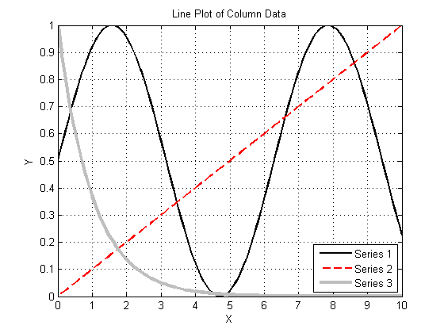

* `fill_between.py`: Same data as `line_plot`, with shaded fill between Series 1 and Series 2

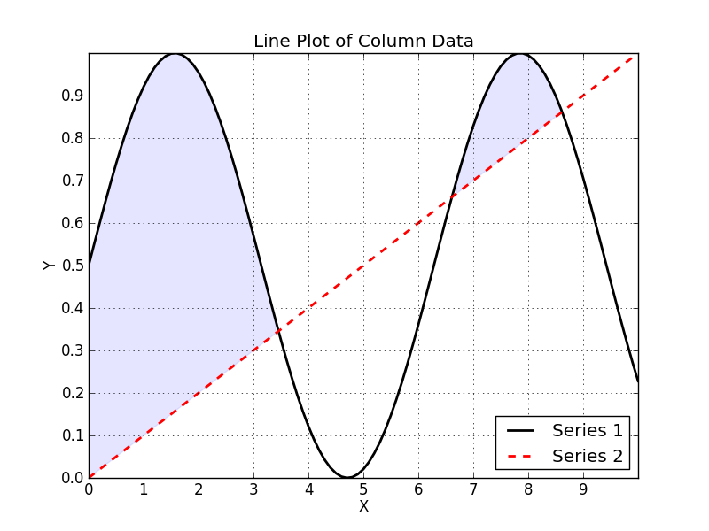

* `stacked_area.m`: Stacked area plot with color options

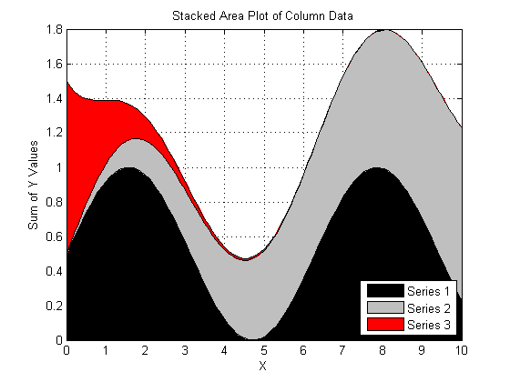

* `animated_gif.m`: Save loop of images as a `.gif` animation

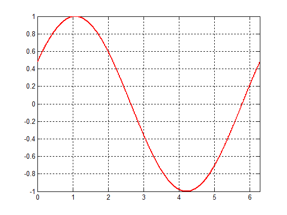

* `histogram_cdf.m`: Standard plots of frequency distributions

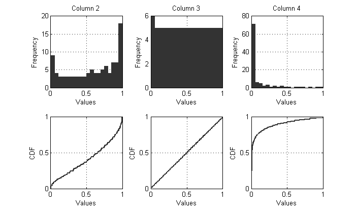

* `parallel_coordinate.m`: Plots row entries as lines instead of columns. Options to scale all values between `[0,1]` and toggle solutions on/off above/below a certain threshold. (These functions are included in `/util/`).

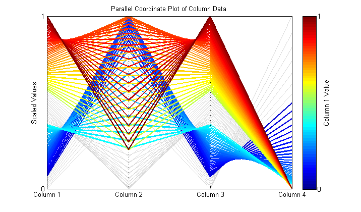

##### Gridded 2D data

From `example_data/gridded_2D.txt`. Used with:

* `imagesc_plot.m`: Show matrix values directly as color blocks

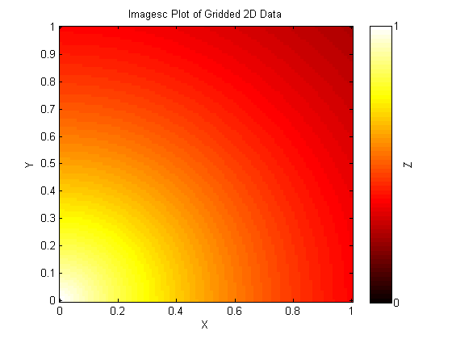

* `contour_surf.m`: Contour, filled contour, and surface plots of meshgrid data

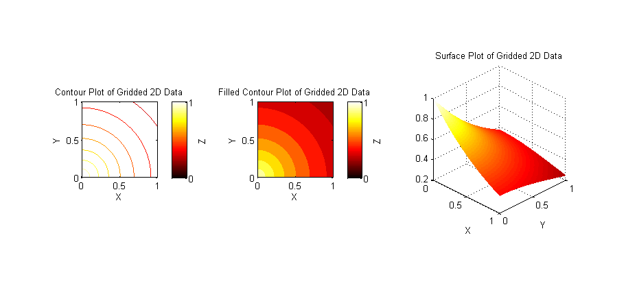

##### Non-Gridded 2D data (e.g. experimental data)

From `example_data/non_gridded_2D.txt`. The data file contains rows of `(x,y,z)` points that are not on a regular grid. Used with:

* `scatter_plot.m`: Plot the irregularly spaced points as dots, with `Z` values as the color

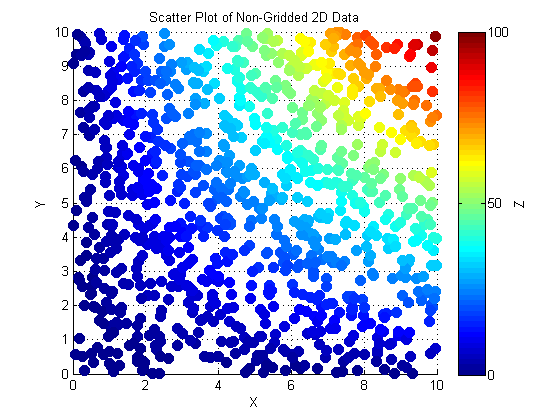

* `contourf_non_gridded.{m,py}`: Use Matlab's built-in `griddata` function to interpolate the data onto a standard meshgrid, which can then be used for standard contour/mesh/surf plots, etc.

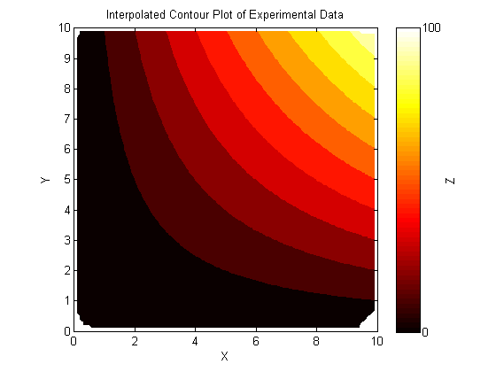

##### Animation

* `animation.py`: Generates its data on the fly to make an animated sinusoid.  The Python version requires `imagemagick`.  After the frames have been generated, run `convert -delay 15 -loop 0 frame*png animation.gif`.

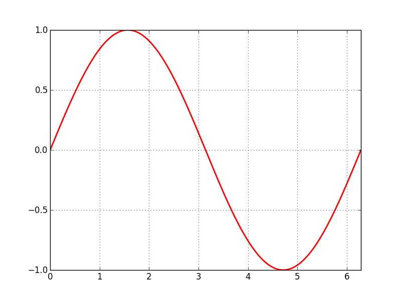

